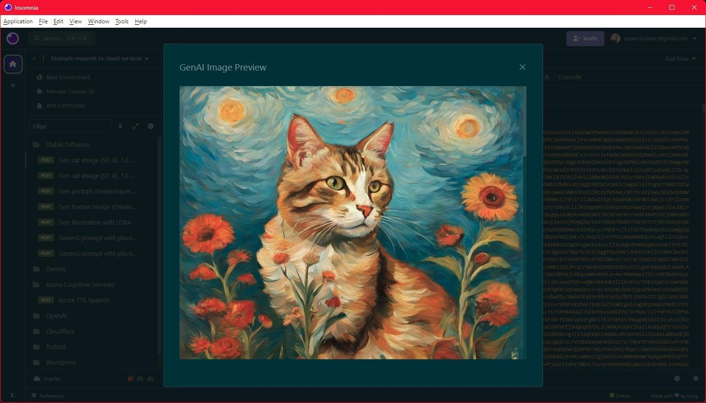

# insomnia-plugin-genai-image-preview

This plugin opens a preview dialog displaying images returned by the GenAI endpoints.

Without this plugin, you only see a JSON with Base64-encoded images in the response.

It supports displaying multiple images (one below another, with a scrollbar) for batch requests that return more than one.

## Supported endpoints:

- [AUTOMATIC1111 Stable Diffusion Web UI](https://github.com/AUTOMATIC1111/stable-diffusion-webui) txt2img API:
    - `POST http://localhost:7860/sdapi/v1/txt2img`
- [OpenAI Dall-E API](https://platform.openai.com/docs/api-reference/images/create):
    - `POST https://api.openai.com/v1/images/generations`

**Please note:** For the OpenAI API, the `"response_format": "b64_json"` [option](https://platform.openai.com/docs/api-reference/images/create) must be set, because otherwise the authentication to download generated images from the storage is tricky.

## Known issues

### Image preview in a dialog, and not in a preview pane

The most natural place for image previews in Insomnia would not be a dialog, but the "Preview" pane. However, the current plugin API doesn't allow adding a custom type of preview.

I considered tricking the program and replacing JSON response with an HTML response containing images, but currently it's not possible to replace the `Content-Type` header of the response (and it would be controversial to modify the response anyway).

### Re-opening the preview

Once you close the preview window, you cannot re-open it. I'm not sure if it's possible to re-open with the current Insomnia plugin API. So it's displayed only once, just after the response comes.

### Degraded performance when working with large responses

I don't think this is related to the plugin, but an observation worth sharing. When working with Prompt-to-Image APIs, Insomnia's performance degrades quite fast. I think it's because responses contain large JSON content. 

I personally reduced the number of response history items stored, and it seemed to have helped a bit, but I haven't performed performance tests.    

## Contribution

My personal usage of Generative AI Image APIs is limited to **Stable Diffusion** and **Dall-E**, and I'm unlikely to spontaneously add support for other endpoints.

If you want to see something else supported, then please:

- Create a GitHub issue with a feature suggestion (please describe as detailed as you can)
- Or modify the plugin code and share the solution via a PR.